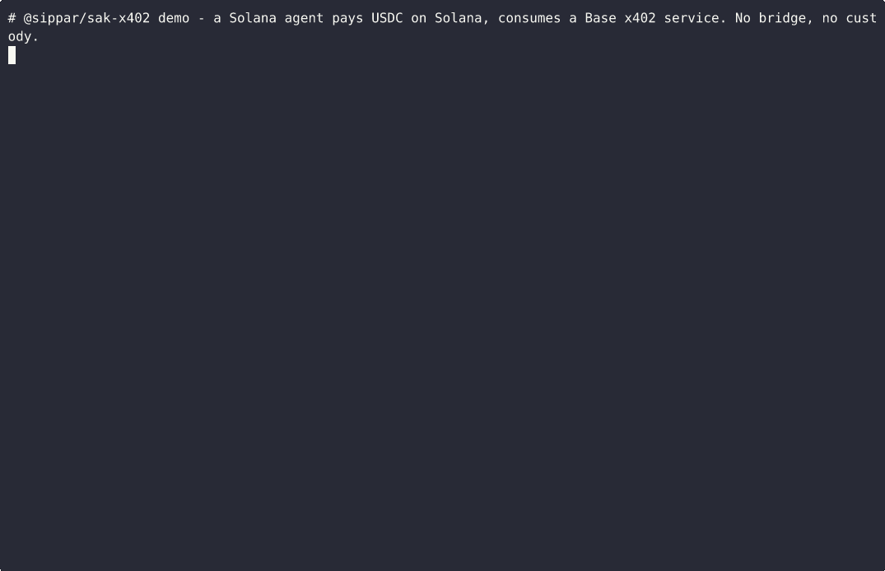

# @sippar/sak-x402

**Sippar is the cross-chain payment highway for AI agents** — and `@sippar/sak-x402` is the on-ramp for Solana agents. Your agent pays for a service on **Base** using the USDC it already holds on **Solana** — no bridge, no second wallet, no seed phrase. One line to add it.

```
Solana agent ──USDC──▶ Sippar ──USDC──▶ Base x402 service
   (signs once)                            (returns data)
```

## See it work



The agent pays ~$0.001 USDC on Solana and gets a live price from a Base service back — with real Solscan + Basescan transaction links.

## Use it

```bash
npm install github:Nuru-AI/sippar-sak-x402
```

Add one line to your [Solana Agent Kit](https://github.com/sendaifun/solana-agent-kit) agent:

```typescript
import { SipparX402Plugin } from '@sippar/sak-x402';

agent.use(SipparX402Plugin);
```

That's it — your agent can now pay for Base x402 services with Solana USDC, and the response comes straight back to it (the relay fetches it for you).

Find a service to pay:

```bash
npx sippar-discover            # lists payable services with their prices and inputs
```

**Full setup, a runnable example, and configuration → [GETTING_STARTED.md](./GETTING_STARTED.md).**

## Use with your AI coding assistant

Building with Claude, Cursor, or another AI assistant? Add `https://gitmcp.io/Nuru-AI/sippar-sak-x402` as an MCP server so it reads these docs while you integrate — no hallucinated APIs.

## Good to know

- Your agent's Solana wallet stays **yours** — Sippar never holds your key.
- **Content privacy is in development:** today the relay fetches the service for you, so your request and the result pass through Sippar. A mode where your agent fetches directly (Sippar only signs the payment) is being built.
- Action reference, direct HTTP/MCP access, and security details live in [GETTING_STARTED.md](./GETTING_STARTED.md).

## License

MIT
